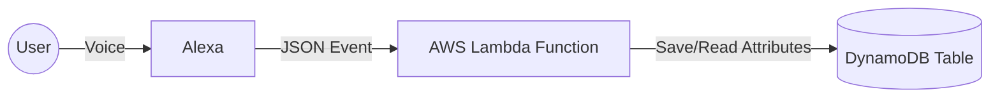

# AWS - Alexa Skill with DynamoDB and Python (v2 Serverless)

> **Note:** This is version 2.0 of the application, refactored to use **Clean Architecture** and **Infrastructure as Code (IaC)** with AWS SAM. The legacy version (v1.0) using S3 can be found at tag `v1.0-legacy-s3`.

## 🚀 New Architecture (v2)

The skill now operates on a 100% Serverless model, using:

- **AWS SAM:** For infrastructure orchestration.
- **AWS Lambda:** Python code execution segmented into handlers.
- **Amazon DynamoDB:** Fast and scalable data persistence (replacing S3).

### Data Flow



### 🛠️ How to Deploy (Install)

1. **Prerequisites:**

   - AWS SAM CLI installed.
   - AWS Credentials configured.
   - Python 3.12+.

2. **Build & Deploy:**

   ```bash
   sam build
   sam deploy --guided
   ```

   Follow the instructions in the terminal. SAM will automatically create the Lambda and DynamoDB Table.

3. **Alexa Console Configuration:**
   - Copy the Lambda ARN generated by the deploy.
   - Paste it into the **Endpoint** tab of your Alexa Skill.

---

### 🏛️ History and Achievements (v1.0)

Below is the tutorial and records of the original version, which reached the mark of **20,000 monthly users**!


This step-by-step guide teaches how to use the code I wrote for my skill. In the official AWS documentation, it is possible to find a guide to develop entry-level applications and support to develop your knowledge in using the Alexa Dot SDK.

The application was named "Teach phrases to Alexa" and is based on a database CRUD system, where the skill will store information which, when requested, will pass it back to the user. The great point of this application is the functionality attributed to it, where the suggested purpose for the user is to teach funny phrases about friends and acquaintances. Once requested to Alexa informing the person's name, the skill will search the database for the stored information and return the funny phrase similar to the one informed before. The phrase will not be returned exactly as it was taught because the skill will adapt it to make it more acceptable and coherent to the ears, for example:

Saying the command below:

```
Alexa, aprenda que " Pedro não gosta de tomar banho"
```

Then the skill will store the phrase information, and when requested with the following voice command:

```
Alexa, o que você sabe sobre Pedro?
```

Alexa will return the following phrase:

```
Eu descobri que Pedro não gosta de tomar banho
```

We notice that Alexa substitutes some elements of the phrase so that it becomes coherent to human ears. The user can add phrases, delete, and substitute information about the assigned names.


#### The installation and configuration part I wrote in English but it is possible to translate it easily with a page translator

Skill consuming the aws service, Skill that learns phrases, remembers and returns intelligently.

<p align="center">
  
</p>

### Requirements

The requirements to run such an application are linked to the infrastructure of amazon skil kits, it being necessary to create an account on the same console, in hardware matters a machine with 2gb of ram and few open pages can run smoothly, taking into account that the amazon own web service for code development.

```
2gb ram - intel processor inside or parallel to it - windows operating system - vs code - python3.7 or higher
account on the platform
```

### Getting Started

To get started, log in to [Alexa developer console](https://developer.amazon.com/alexa/console/ask) with your Amazon Developer account. If you don't have an account, [click here](https://www.amazon.com/ap/register?clientContext=131-0331464-9465436&openid.identity=http%3A%2F%2Fspecs.openid.net%2Fauth%2F2.0%2Fidentifier_select&siteState=clientContext%3D142-6935021-1894360%2CsourceUrl%3Dhttps%253A%252F%252Fdeveloper.amazon.com%252Falexa%2Csignature%3Doyixlki7Yxz8bRUtt4vGJ4EugQ8j3D&marketPlaceId=ATVPDKIKX0DER&language=en_US&pageId=amzn_developer_portal&openid.return_to=https%3A%2F%2Fdeveloper.amazon.com%2Falexa&prevRID=HSRBQ1KHA4E5D1PBHPPP&openid.assoc_handle=mas_dev_portal&openid.mode=checkid_setup&prepopulatedLoginId=&failedSignInCount=0&openid.claimed_id=http%3A%2F%2Fspecs.openid.net%2Fauth%2F2.0%2Fidentifier_select&openid.ns=http%3A%2F%2Fspecs.openid.net%2Fauth%2F2.0) to create one.

<p align="center">
  
</p>

## Running 0.1

After creating the account look for the console button located in some corner of the screen it may be different from the image below because amazon modifies the website design constantly for a better user experience.

<p align="center">
  
</p>

## Running 0.2

Now look for the area written "code" to go to the development area.

<p align="center">
  
</p>

At this point you should add the code in all areas for the code to work properly, note that the lambda file contains the files:

- lambda-function.py
- requeriments.txt
- utils.py

<p align="center">
  
</p>
It is necessary to import additions correctly so that the S3 storage can receive the data correctly.

## Important to note

I chose to use all the service indicated on amazon sdk as a database, json etc ... but there is the option to use other banks in my readings I found a lot about dynamoDB it is offered by Amazon as part of the Amazon Web Services portfolio , however it is possible to use others like mongoDB and parallels.

## Running 0.3

Now look for the area written "Build" to develop the intents

<p align="center">
  
</p>

Search for the name intents and create a new intent as the images illustrate and exactly as written below, if you find it necessary to modify the name of the intent remember that it must be modified in all the code in the lambda file.

```
CaptureRecordindintent

```

After creating the intent it will be necessary to develop a call for it, I opted for "unknown" [to call it] and right after creating phrase options that users can say to interact with the skill.

 <p align="center">
  
</p>

Now it will be necessary to define which type of slot the intent will use, I opted for "AMAZON.SearchQuery" was the one that had the best response and at the time of certification of the skill the architects of aws instructed me to use it.

```
choose slot type: AMAZON.SearchQuery

```

<p align="center">
  
</p>

## Running 0.4

Now look for the area written "test" to test the skill.

<p align="center">
  
</p>

You will see a test console in the drop-down menu at the top of the page, select Development:

<p align="center">
  
</p>

After that use the call phrases of the skill and it should return that you learned:

<p align="center">
  
</p>

### Final considerations

This is a brief indication and a way to start a simple skill, if you find it difficult to develop it is interesting to consult the guide developed by the website for a better explanation about the console and the services provided by AWS. It is important to pay attention to the code, as the information is directed to the cloud service. If you want to delete the learning that Alex had, you will need to delete the media from the S3 storage.
